# Quadruped Robot Stabilization System 🤖

[](https://www.python.org/downloads/)
[](https://opensource.org/licenses/MIT)
[](https://www.raspberrypi.org/)

A real-time stabilization system for quadruped robots using IMU-based orientation detection and inverse kinematics for leg position adjustment.

<div align="center">
  
</div>

## 🌟 Features

- Real-time IMU (MPU-6050) orientation detection
- 3D visualization of robot pose and leg positions
- Inverse kinematics for precise leg adjustments
- Simulation mode for testing without hardware
- Arduino-based servo control system
- Support for DS3225 servos (270° range)

## 🛠️ Hardware Requirements

- Raspberry Pi 4 Model B
- Arduino Mega 2560 Rev 3
- MPU-6050 IMU Sensor
- 12× DS3225 Servo Motors
- Quadruped Robot Frame
  - Body: 274mm × 140mm
  - Leg Length: 193mm
  - Standing Height: 125mm

## 📊 System Architecture

```mermaid
graph TD
    A[MPU-6050 IMU] -->|I2C| B[Raspberry Pi]
    B -->|Process Orientation| C[Compute Rotation Matrix]
    C -->|Calculate Adjustments| D[Inverse Kinematics]
    D -->|Serial Commands| E[Arduino Mega]
    E -->|PWM Control| F[12× DS3225 Servos]
    B -->|Visualization| G[3D Display]
```



## 🚀 Quick Start

1. **Create and activate virtual environment:**
   ```bash
   python -m venv venv
   source venv/bin/activate  # On Unix/macOS
   # or
   .\venv\Scripts\activate  # On Windows
   ```

2. **Install dependencies:**
   ```bash
   pip install -r requirements.txt
   ```

3. **Upload Arduino code:**
   - Open `quadruped_servo_controller/quadruped_servo_controller.ino` in Arduino IDE
   - Select Arduino Mega 2560 board
   - Upload the code

4. **Run the system:**
   ```bash
   python imu_stabilization.py
   ```

## 💻 Development Mode

The system includes a simulation mode that runs automatically on non-Linux systems:
- Simulates IMU readings
- Shows 3D visualization
- Prints servo commands
- No hardware required

## 🎮 Controls & Visualization

The 3D visualization provides:
- Real-time robot pose display
- Color-coded legs:
  - 🔴 Front Left
  - 🟢 Front Right
  - 🔵 Back Left
  - 🟡 Back Right
- Interactive view controls:
  - Left-click & drag: Rotate
  - Right-click & drag: Zoom
  - Middle-click & drag: Pan

## 📐 Servo Configuration

```python
Servo Layout:
FL (Front Left):  Pins 5, 6, 7   [Shoulder, Knee, Ankle]
FR (Front Right): Pins 2, 3, 4
BL (Back Left):   Pins 11, 12, 13
BR (Back Right):  Pins 8, 9, 10
```

## 🔧 Customization

Adjust robot dimensions in `stabilization_control.py`:
```python
self.BODY_LENGTH = 274  # mm
self.BODY_WIDTH = 140   # mm
self.LEG_LENGTH = 193   # mm
self.DEFAULT_HEIGHT = 125  # mm
```

## 📊 Data Flow

1. IMU reads orientation (pitch, roll, yaw)
2. System computes rotation matrix
3. Inverse kinematics calculates leg positions
4. Arduino receives servo commands
5. Servos adjust to stabilize platform

## 🤝 Contributing

1. Fork the repository
2. Create a feature branch
3. Commit your changes
4. Push to the branch
5. Open a Pull Request

## 📝 License

This project is licensed under the MIT License - see the [LICENSE](LICENSE) file for details.

## 🔍 Troubleshooting

Common issues and solutions:

| Issue | Solution |
|-------|----------|
| No IMU connection | Check I2C address and connections |
| Servo jitter | Verify power supply capacity |
| Arduino not found | Check USB port and permissions |
| Visualization lag | Adjust update rate in code |

## 📞 Support

- Create an issue for bugs
- Start a discussion for questions
- Pull requests are welcome!